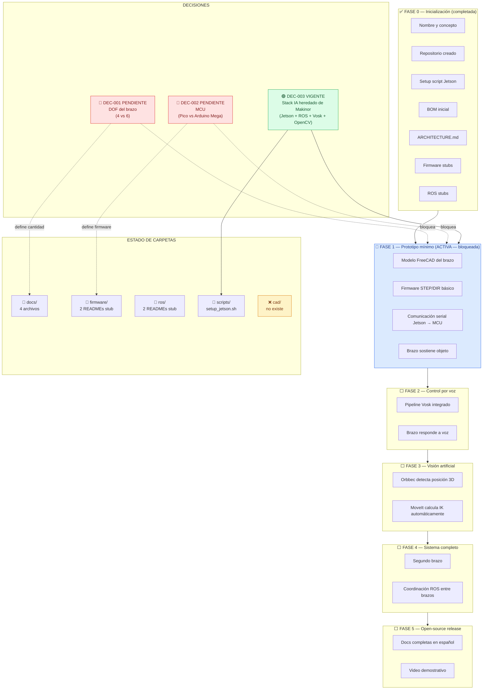
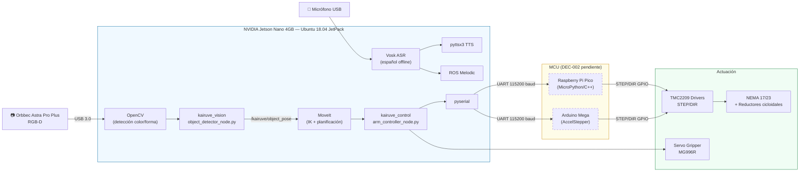
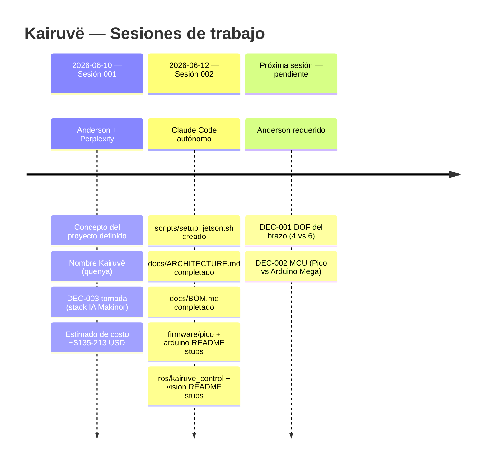

# GRAPHIFY.md — Mapa visual del estado actual de Kairuvë

> Generado automáticamente por `/graphify` — sesión 2026-06-15.
> 45 nodos · 50 aristas · 15 comunidades detectadas.
> Fuente de verdad: ROADMAP.md, DECISIONS.md, SESSIONS.md, CONTRIBUTING.md.

---

## 1. Mapa de estado del proyecto



---

## 2. Árbol de archivos real

```
kairuve/kairuve/
│
├── README.md                          # Presentación del proyecto
├── DECISIONS.md                       # Decisiones de diseño (DEC-001, DEC-002, DEC-003)
├── ROADMAP.md                         # Fases del proyecto (0→5)
├── STATUS.md                          # Estado actual — leer primero cada sesión
├── SESSIONS.md                        # Log de sesiones de trabajo
├── CONTRIBUTING.md                    # Protocolo de sesión y destinos de escritura
│
├── docs/
│   ├── ARCHITECTURE.md                # Diagrama de bloques + interfaces de comunicación
│   ├── BOM.md                         # Lista de materiales (cantidades TBD hasta DEC-001/002)
│   ├── ASSEMBLY.md                    # Manual de ensamble (en construcción)
│   └── REFERENCES.md                  # Proyectos de referencia y recursos técnicos
│
├── firmware/
│   ├── pico/
│   │   └── README.md                  # Stub: firmware Pico pendiente de DEC-002
│   └── arduino/
│       └── README.md                  # Stub: firmware Arduino pendiente de DEC-002
│
├── ros/
│   ├── kairuve_control/
│   │   └── README.md                  # Stub: nodo brazo pendiente de DEC-001 + DEC-002
│   └── kairuve_vision/
│       └── README.md                  # Stub: nodo visión (Orbbec + OpenCV)
│
└── scripts/
    └── setup_jetson.sh                # Setup completo JetPack 4.6.x: ROS + MoveIt + Vosk

[❌ cad/]                              # No existe — pendiente hasta tener DEC-001
```

---

## 3. Mapa de dependencias de software



---

## 4. Timeline de sesiones



---

## 5. Matriz de completitud

> Basada en los destinos de escritura definidos en `CONTRIBUTING.md`.

| Archivo / Carpeta esperado | Estado | Notas |
|---|---|---|
| `DECISIONS.md` | ✅ | DEC-001 y DEC-002 pendientes; DEC-003 vigente |
| `docs/BOM.md` | ✅ | Cantidades TBD bloqueadas por DEC-001/002 |
| `docs/ASSEMBLY.md` | 🚧 | Estructura prevista, sin contenido real aún |
| `docs/ARCHITECTURE.md` | ✅ | Completo con interfaces y decisiones pendientes |
| `docs/REFERENCES.md` | ✅ | 3 proyectos de referencia + recursos técnicos |
| `firmware/pico/` | 🚧 | Solo README stub — firmware pendiente DEC-002 |
| `firmware/arduino/` | 🚧 | Solo README stub — firmware pendiente DEC-002 |
| `ros/kairuve_control/` | 🚧 | Solo README stub — impl. pendiente DEC-001+002 |
| `ros/kairuve_vision/` | 🚧 | Solo README stub — impl. pendiente DEC-001 |
| `cad/freecad/` | ❌ | No existe — necesita FreeCAD + DEC-001 |
| `cad/stl/` | ❌ | No existe — necesita modelo CAD primero |
| `SESSIONS.md` | ✅ | 2 sesiones registradas |
| `STATUS.md` | ✅ | Actualizado a sesión 2026-06-12 |
| `ROADMAP.md` | ✅ | Fases 0–5 definidas |
| `scripts/setup_jetson.sh` | ✅ | Setup completo JetPack 4.6.x |

**Resumen**: 7 ✅ · 5 🚧 · 2 ❌

> Los 2 ❌ (cad/) y los 4 🚧 de firmware/ROS dependen de DEC-001 y DEC-002.
> Una vez tomadas esas decisiones con Anderson, el 🚧 se convierte en trabajo directo.
